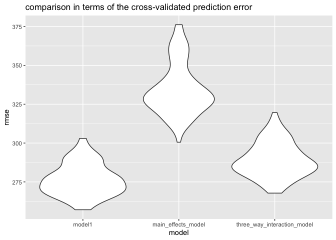
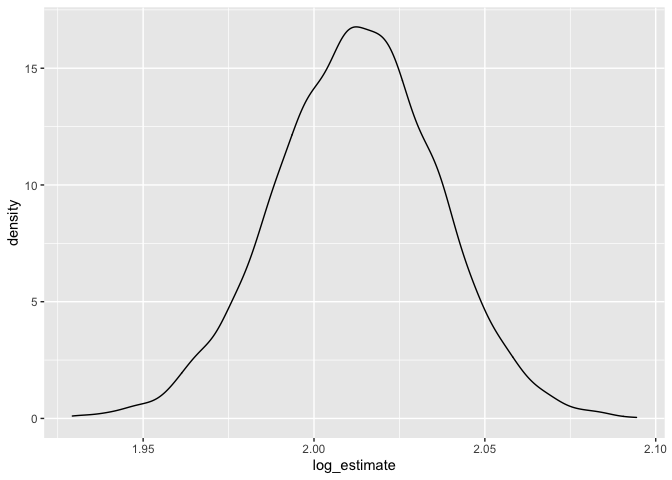
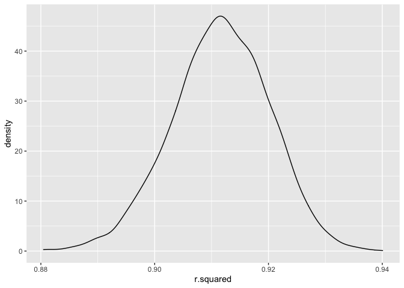
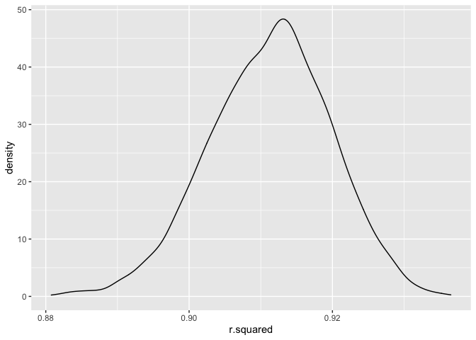

p8105\_hw6\_sl5010
================
Fiona Li
11/30/2021

## Problem 1

``` r
library(tidyverse)
```

    ## ── Attaching packages ─────────────────────────────────────── tidyverse 1.3.1 ──

    ## ✓ ggplot2 3.3.5     ✓ purrr   0.3.4
    ## ✓ tibble  3.1.4     ✓ dplyr   1.0.7
    ## ✓ tidyr   1.1.3     ✓ stringr 1.4.0
    ## ✓ readr   2.0.1     ✓ forcats 0.5.1

    ## ── Conflicts ────────────────────────────────────────── tidyverse_conflicts() ──
    ## x dplyr::filter() masks stats::filter()
    ## x dplyr::lag()    masks stats::lag()

``` r
library(modelr)
library(mgcv)
```

    ## Loading required package: nlme

    ## 
    ## Attaching package: 'nlme'

    ## The following object is masked from 'package:dplyr':
    ## 
    ##     collapse

    ## This is mgcv 1.8-36. For overview type 'help("mgcv-package")'.

``` r
## Load and clean the data for regression analysis
birthweight = read_csv("Data/birthweight.csv") %>%
mutate(babysex = as_factor(babysex))%>%
mutate(frace = as_factor(frace))%>%
mutate(malform = as_factor(malform))%>%
mutate(mrace = as_factor(mrace))
```

    ## Rows: 4342 Columns: 20

    ## ── Column specification ────────────────────────────────────────────────────────
    ## Delimiter: ","
    ## dbl (20): babysex, bhead, blength, bwt, delwt, fincome, frace, gaweeks, malf...

    ## 
    ## ℹ Use `spec()` to retrieve the full column specification for this data.
    ## ℹ Specify the column types or set `show_col_types = FALSE` to quiet this message.

``` r
sum(is.na(birthweight))
```

    ## [1] 0

``` r
head(birthweight) 
```

    ## # A tibble: 6 × 20
    ##   babysex bhead blength   bwt delwt fincome frace gaweeks malform menarche
    ##   <fct>   <dbl>   <dbl> <dbl> <dbl>   <dbl> <fct>   <dbl> <fct>      <dbl>
    ## 1 2          34      51  3629   177      35 1        39.9 0             13
    ## 2 1          34      48  3062   156      65 2        25.9 0             14
    ## 3 2          36      50  3345   148      85 1        39.9 0             12
    ## 4 1          34      52  3062   157      55 1        40   0             14
    ## 5 2          34      52  3374   156       5 1        41.6 0             13
    ## 6 1          33      52  3374   129      55 1        40.7 0             12
    ## # … with 10 more variables: mheight <dbl>, momage <dbl>, mrace <fct>,
    ## #   parity <dbl>, pnumlbw <dbl>, pnumsga <dbl>, ppbmi <dbl>, ppwt <dbl>,
    ## #   smoken <dbl>, wtgain <dbl>

Number of missing data is **0**.

``` r
## Propose a regression model for birthweight.
birthweight %>% 
  lm(bwt ~ babysex+bhead+blength+delwt+fincome+frace+gaweeks+malform+menarche+mheight+momage+mrace+parity+pnumlbw+pnumsga+ppbmi+ppwt+smoken+wtgain, data = .) %>% 
  broom::tidy() %>% 
  knitr::kable(digits = 3)
```

| term        |  estimate | std.error | statistic | p.value |
|:------------|----------:|----------:|----------:|--------:|
| (Intercept) | -6265.391 |   660.401 |    -9.487 |   0.000 |
| babysex2    |    28.707 |     8.465 |     3.391 |   0.001 |
| bhead       |   130.778 |     3.452 |    37.881 |   0.000 |
| blength     |    74.954 |     2.022 |    37.075 |   0.000 |
| delwt       |     4.101 |     0.395 |    10.386 |   0.000 |
| fincome     |     0.290 |     0.180 |     1.614 |   0.107 |
| frace2      |    14.331 |    46.150 |     0.311 |   0.756 |
| frace3      |    21.236 |    69.296 |     0.306 |   0.759 |
| frace4      |   -46.996 |    44.678 |    -1.052 |   0.293 |
| frace8      |     4.297 |    74.074 |     0.058 |   0.954 |
| gaweeks     |    11.549 |     1.465 |     7.882 |   0.000 |
| malform1    |     9.765 |    70.626 |     0.138 |   0.890 |
| menarche    |    -3.551 |     2.895 |    -1.226 |   0.220 |
| mheight     |     9.787 |    10.312 |     0.949 |   0.343 |
| momage      |     0.759 |     1.222 |     0.621 |   0.534 |
| mrace2      |  -151.435 |    46.045 |    -3.289 |   0.001 |
| mrace3      |   -91.387 |    71.919 |    -1.271 |   0.204 |
| mrace4      |   -56.479 |    45.137 |    -1.251 |   0.211 |
| parity      |    95.541 |    40.479 |     2.360 |   0.018 |
| pnumlbw     |        NA |        NA |        NA |      NA |
| pnumsga     |        NA |        NA |        NA |      NA |
| ppbmi       |     4.354 |    14.891 |     0.292 |   0.770 |
| ppwt        |    -3.472 |     2.612 |    -1.329 |   0.184 |
| smoken      |    -4.854 |     0.587 |    -8.269 |   0.000 |
| wtgain      |        NA |        NA |        NA |      NA |

at *α* = 0.05, we choose the significant factors: parity, mrace,
gaweeks, babysex, bhead, blength and delwt

``` r
## get model 1
model1 = 
birthweight %>%
  lm(bwt ~ parity + mrace + gaweeks+babysex+bhead+blength+delwt, data = .)
modelr::add_residuals(birthweight, model1)
```

    ## # A tibble: 4,342 × 21
    ##    babysex bhead blength   bwt delwt fincome frace gaweeks malform menarche
    ##    <fct>   <dbl>   <dbl> <dbl> <dbl>   <dbl> <fct>   <dbl> <fct>      <dbl>
    ##  1 2          34      51  3629   177      35 1        39.9 0             13
    ##  2 1          34      48  3062   156      65 2        25.9 0             14
    ##  3 2          36      50  3345   148      85 1        39.9 0             12
    ##  4 1          34      52  3062   157      55 1        40   0             14
    ##  5 2          34      52  3374   156       5 1        41.6 0             13
    ##  6 1          33      52  3374   129      55 1        40.7 0             12
    ##  7 2          33      46  2523   126      96 2        40.3 0             14
    ##  8 2          33      49  2778   140       5 1        37.4 0             12
    ##  9 1          36      52  3515   146      85 1        40.3 0             11
    ## 10 1          33      50  3459   169      75 2        40.7 0             12
    ## # … with 4,332 more rows, and 11 more variables: mheight <dbl>, momage <dbl>,
    ## #   mrace <fct>, parity <dbl>, pnumlbw <dbl>, pnumsga <dbl>, ppbmi <dbl>,
    ## #   ppwt <dbl>, smoken <dbl>, wtgain <dbl>, resid <dbl>

``` r
modelr::add_predictions(birthweight, model1)
```

    ## # A tibble: 4,342 × 21
    ##    babysex bhead blength   bwt delwt fincome frace gaweeks malform menarche
    ##    <fct>   <dbl>   <dbl> <dbl> <dbl>   <dbl> <fct>   <dbl> <fct>      <dbl>
    ##  1 2          34      51  3629   177      35 1        39.9 0             13
    ##  2 1          34      48  3062   156      65 2        25.9 0             14
    ##  3 2          36      50  3345   148      85 1        39.9 0             12
    ##  4 1          34      52  3062   157      55 1        40   0             14
    ##  5 2          34      52  3374   156       5 1        41.6 0             13
    ##  6 1          33      52  3374   129      55 1        40.7 0             12
    ##  7 2          33      46  2523   126      96 2        40.3 0             14
    ##  8 2          33      49  2778   140       5 1        37.4 0             12
    ##  9 1          36      52  3515   146      85 1        40.3 0             11
    ## 10 1          33      50  3459   169      75 2        40.7 0             12
    ## # … with 4,332 more rows, and 11 more variables: mheight <dbl>, momage <dbl>,
    ## #   mrace <fct>, parity <dbl>, pnumlbw <dbl>, pnumsga <dbl>, ppbmi <dbl>,
    ## #   ppwt <dbl>, smoken <dbl>, wtgain <dbl>, pred <dbl>

``` r
birthweight %>% 
  modelr::add_residuals(model1) %>%
  modelr::add_predictions(model1) %>%
  ggplot(aes(x = pred, y = resid)) + geom_point(alpha = .3) + labs(title = "plot of model residuals against fitted values")
```

<!-- -->

``` r
main_effects_model = lm(bwt ~ blength +gaweeks, data = birthweight)
three_way_interaction_model=  lm(bwt ~ bhead*blength*babysex, data = birthweight)
```

``` r
cv_df =
  crossv_mc(birthweight, 100) %>% 
  mutate(
    train = map(train, as_tibble),
    test = map(test, as_tibble))
cv_df = 
  cv_df %>% 
  mutate(
    model1  = map(train, ~lm(bwt ~ parity + mrace + gaweeks+babysex+bhead+blength+delwt, data = .x)),
    main_effects_model = map(train, ~lm(bwt ~ blength +gaweeks, data = .x)),
    three_way_interaction_model = map(train, ~gam(bwt ~ bhead*blength*babysex, data = as_tibble(.x)))) %>% 
  mutate(
    rmse_model1 = map2_dbl(model1, test, ~rmse(model = .x, data = .y)),
    rmse_main_effects_model = map2_dbl(main_effects_model, test, ~rmse(model = .x, data = .y)),
    rmse_three_way_interaction_model = map2_dbl(three_way_interaction_model, test, ~rmse(model = .x, data = .y)))
```

    ## Warning in predict.lm(model, data): prediction from a rank-deficient fit may be
    ## misleading

``` r
## get the plot
cv_df %>% 
  select(starts_with("rmse")) %>% 
  pivot_longer(
    everything(),
    names_to = "model", 
    values_to = "rmse",
    names_prefix = "rmse_") %>% 
  mutate(model = fct_inorder(model)) %>% 
  ggplot(aes(x = model, y = rmse)) + geom_violin() + labs(title = "comparison in terms of the cross-validated prediction error")
```

<!-- -->
\#\# Problem 2

``` r
## getting the data
weather_df = 
  rnoaa::meteo_pull_monitors(
    c("USW00094728"),
    var = c("PRCP", "TMIN", "TMAX"), 
    date_min = "2017-01-01",
    date_max = "2017-12-31") %>%
  mutate(
    name = recode(id, USW00094728 = "CentralPark_NY"),
    tmin = tmin / 10,
    tmax = tmax / 10) %>%
  select(name, id, everything())
```

    ## Registered S3 method overwritten by 'hoardr':
    ##   method           from
    ##   print.cache_info httr

    ## using cached file: ~/Library/Caches/R/noaa_ghcnd/USW00094728.dly

    ## date created (size, mb): 2021-11-30 17:14:01 (7.614)

    ## file min/max dates: 1869-01-01 / 2021-11-30

``` r
## bootstrap
weather_df %>% 
  modelr::bootstrap(n = 5000) %>% 
  mutate(
    models = map(strap, ~ lm(tmin ~ tmax, data = .x)),
    results = map(models, broom::tidy)) %>% 
  select(results) %>% 
  unnest(results) %>% 
  ggplot(aes(x = estimate)) + geom_density()
```

<!-- -->

``` r
 bootstrap_results = 
 weather_df %>% 
  modelr::bootstrap(n = 5000) %>% 
  mutate(
    models = map(strap, ~lm(tmax ~ tmin, data = .x) ),
    results = map(models, broom::tidy)) %>% 
  select(-strap, -models) %>% 
  unnest(results) 

bootstrap_results %>% 
  group_by(term) %>% 
  summarize(boot_se = sd(estimate))%>% 
  knitr::kable(digits = 3)
```

| term        | boot\_se |
|:------------|---------:|
| (Intercept) |    0.256 |
| tmin        |    0.017 |

``` r
bootstrap_logresults = 
bootstrap_results %>%  
  select(term,.id,estimate) %>%
  pivot_wider(
    names_from = term,
    values_from = estimate) %>%
  rename(Intercept = "(Intercept)") %>%
  mutate(log_estimate = log(Intercept*tmin))

bootstrap_logresults %>% 
  summarize(
    ci_lower = quantile(log_estimate, 0.025), 
    ci_upper = quantile(log_estimate, 0.975))
```

    ## # A tibble: 1 × 2
    ##   ci_lower ci_upper
    ##      <dbl>    <dbl>
    ## 1     1.97     2.06

``` r
bootstrap_logresults %>%
   ggplot(aes(x = log_estimate)) + geom_density()
```

<!-- -->

``` r
 bootstrap_results2 = 
 weather_df %>% 
  modelr::bootstrap(n = 5000) %>% 
  mutate(
    models = map(strap, ~lm(tmax ~ tmin, data = .x) ),
    results = map(models, broom::glance)) %>% 
  select(-strap, -models) %>% 
  unnest(results) 

bootstrap_results2 %>% 
  summarize(
    ci_lower = quantile(r.squared, 0.025), 
    ci_upper = quantile(r.squared, 0.975))
```

    ## # A tibble: 1 × 2
    ##   ci_lower ci_upper
    ##      <dbl>    <dbl>
    ## 1    0.894    0.927

``` r
 bootstrap_results2 %>%
   ggplot(aes(x = r.squared)) + geom_density()
```

<!-- -->
